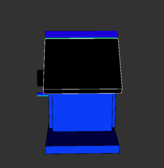

# birdhouse

3D rendering of a birdhouse using p5.js library.

## License

This project is licensed under the "All Rights Reserved" terms. You may not use, distribute, or modify this work without explicit permission from the author.
Additionally, this work may not be used, in whole or in part, for the training of any artificial intelligence (AI) systems or machine learning models.
